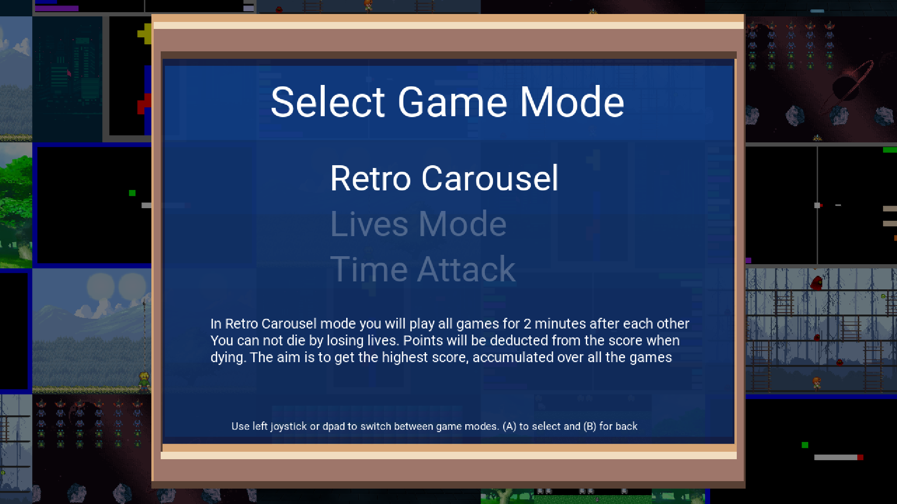

# RetroTime
   

RetroTime is a game containing 8 retro based games playable in 3 game modes being Retro Carousel, Time Attack and Lives mode. The game is a port from my competetion entry for Fuze 4 for Nintendo switch, in colleboration Wireframe magazine. 

## Game Modes

The games can be played in 3 game modes

### Retro Carousel Mode
In Retro Carousel mode you will play all games for 2 minutes after each other. You can not die by losing lives. Points will be deducted from the score when dying. The aim is to get the highest score, accumulated over all the games.

### Lives Mode 
In Lives mode you play a single game and start with a fixed amount of lives. Dying will lose you one live. The game is over if the lives reaches 0. The aim of the game is to get the highest score possible without dying.

###  Time Attack
In Time Attack mode you play a single game for 5 minutes. You can not die by losing lives. Points will be deducted from the score when dying. The aim is to get the highest score during these 5 minutes of playing.
 
 
## Games
There are 8 retro based games implemented in this game

### Invaders

Invaders is a game based on Space Invaders (Arcade). Rows of enemies are closing in you. You have to shoot them down before they reach your mining asteroids. Shooting down enemies gains points, shooting down all enemies gains extra points. You can move with dpad of left joystick and shoot with (A). If enemies reach your mining asteroids you will lose a life. Avoid being shot or you will also lose a life. 

### Brick Breaker

Brick Breaker is a game based on Breakout (Arcade). Rows of blocks have to be destroyed by touching them with the ball. You control the  paddle at the bottom of the screen with the left joystick or dpad. Keeping (A) pressed speeds up the paddle. You have to let the ball bounce of your paddle to send it back in the playfield. Destroying blocks gains points. Fail to bounce back the ball and you lose a life.

### Toady

Toady is a game based on Frogger (Arcade). You control the pet by left joystick or dpad and you have to keep moving up. Each time you move up to a place you had not reached yet, you will gain points. Avoid getting hit by traffic, don't fall into water, don't exceed the edges of the playfield or you will lose a life. Collect diffrent fruit to gain extra score.

### Snakey

Snakey is a game based on well snake (Nokia 3310). You control a snake's head (red block) by the left joystick or dpad. The snake can move in four directions and wants food (green blocks). Each time you eat food the snake's body will grow. Eat food to gain points, the longer your snake is to more points you will gain. Touching the snake's body or going outside the playfield will lose you a life.

### Bubble Buster

Bubble Buster is a game based on Pang (Arcade). You control a player that needs to pop bubbles. You can control the player using the left joystick or dpad and shoot at bubbles using (A) button. If you hit a bubble it will split up into smaller bubbles and you gain points. Get hit by a bubble and you will lose a life, making you temporary invincible but you can not shoot during this time. Clearing all bubbles gives you extra points.

### Block Stacker

Block Stacker is a game of tetris. You control the blocks with the left joystick or dpad. You need to stack them in such a manner that they form complete rows. Once this is done that row will be removed. Speed increases gradually and having no place at the top to place a block will lose you a life. You can rotate blocks using (A) and quick drop them using (B).

### Color Invasion

Color Invasion is a game based on Ram-It (Atari 2600). You control the cannon with the left joystick or dpad. You need to shoot the invading colored bars completely of the screen using (A). Points are awarded when the color bar is completely of the screen, the closer a bar had gotten to the cannon the more points you will gain. You also gain extra points for clearing all bars from the screen. When a colored bar reaches the cannon rail you will lose a life.

### Faster Dave

Faster Dave is a game based on Fast Eddie (Atari 2600). You control Dave with the left joystick or dpad. You need to avoid or jump over enemies with the (A) button while collecting the magic balls. When you collect 9 balls the end level key is reachable. You are safe on ladders. Points are received for collecting magic balls and getting the end level key. Collecting the 10th magic ball is not required. When you touch an enemy you will a lose life. Every 5 levels, level layout changes.

## Controls
The game can be played using keyboard and joy/gamepads. You can not however remap any keys or joypad buttons. 

| Key / Button | Action |
| ------------ | ------ |
| Joystick, D-Pad, Arrow keys | Directional movement of the player, making selections in the menu's |
| A button or Space key | Confirming in menus, the main game action |
| B & Back button or Esc Key | Back in menus |
| B button or Ctrl key | Secondary action in blockstacker game |
| Start button or Esc Key | Confirming in menus, Pausing during gameplay |
| F4 key | Immediatly Quit the game |
| F3 key | Switch between fullscreen & windowed mode |

## CommandLine Parameters
The game has a few commandline parameters you can pass to it. you append these parameters at the end of the exe.
For example `retrotime.exe -s -w` would run the game in software mode and startup in windowed mode.

| Parameter | Meaning |
| ------------ | ------ |
| -s | Use Software Rendering (slow) |
| -w | Start up game in windowed mode |
| -f | Show FPS |

## Credits
The game makes uses of multiple payed and free assets packs, below are the credits for them per game.

### Main Game User interface 
| Asset | Asset Pack |
| ----- | --------- |
| Music.ogg | Created and Owned by me on [Strofe](https://www.strofe.com/) |
| back.wav | [ Game Music Stingers And UI SFX Pack 2 by wowsounds](https://www.gamedevmarket.net/asset/game-music-stingers-and-ui-sfx-pack-2/) |
| confirm.wav | [ Game Music Stingers And UI SFX Pack 2 by wowsounds](https://www.gamedevmarket.net/asset/game-music-stingers-and-ui-sfx-pack-2/) |
| select.wav | [ Game Music Stingers And UI SFX Pack 2 by wowsounds](https://www.gamedevmarket.net/asset/game-music-stingers-and-ui-sfx-pack-2/) |
| score.ogg | [8-bit Action Music & SFX by Joel Steudler](https://joelsteudler.itch.io/8-bit-action-music-sfx) |
| medal.png | [Kenney medals](https://www.kenney.nl/assets/medals) |
| frame.png | [Hazy Hills Battle Background ansimuz](https://ansimuz.itch.io/hazy-hills-battle-background) |

### Shared between games
| Asset | Asset Pack |
| ----- | --------- |
| die.wav | [8-bit Action Music & SFX by Joel Steudler](https://joelsteudler.itch.io/8-bit-action-music-sfx) |
| coin.wav | [8-bit Action Music & SFX by Joel Steudler](https://joelsteudler.itch.io/8-bit-action-music-sfx) |
| succes.wav | [8-bit Action Music & SFX by Joel Steudler](https://joelsteudler.itch.io/8-bit-action-music-sfx) |
| one.wav | My own recorded voice with a robot filter |
| oneminute.wav |  My own recorded voice with a robot filter |
| readygo.wav |  My own recorded voice with a robot filter |
| three.wav |  My own recorded voice with a robot filter |
| timeover.wav |  My own recorded voice with a robot filter |
| two.wav |  My own recorded voice with a robot filter |

### Block Stacker
| Asset | Asset Pack |
| ----- | --------- |
| Music.ogg | Created and Owned by me on [Strofe](https://www.strofe.com/) |
| rotate.wav | [Game Music Stingers And UI SFX Pack 2 by wowsounds](https://www.gamedevmarket.net/asset/game-music-stingers-and-ui-sfx-pack-2/) |
| drop.wav | [Pro Sound Collection by gamemasteraudio](https://www.gamedevmarket.net/asset/pro-sound-collection/) |
| lineclear.ogg | [8-bit Action Music & SFX by Joel Steudler](https://joelsteudler.itch.io/8-bit-action-music-sfx) |
| background.png | [Cyberpunk Street Environment by ansimuz](https://ansimuz.itch.io/cyberpunk-street-environment) |

### Brick Breaker
| Asset | Asset Pack |
| ----- | --------- |
| Music.ogg | Created and Owned by me on [Strofe](https://www.strofe.com/) |
| bat.wav | [Pro Sound Collection by gamemasteraudio](https://www.gamedevmarket.net/asset/pro-sound-collection/) |
| brick.wav | [VS-01-Cowbell004.wav from Gijs De Mik](https://stardust-audio.com/Down/GijsPerc2017.zip) |
| background.png | [Basic breakout asset pack created by me (joyrider3774)](https://joyrider3774.itch.io/basic-breakout-asset-pack) |
| ball.png | [Basic breakout asset pack created by me (joyrider3774)](https://joyrider3774.itch.io/basic-breakout-asset-pack) |
| blocks.png | [Basic breakout asset pack created by me (joyrider3774)](https://joyrider3774.itch.io/basic-breakout-asset-pack) |
| paddle.png | [Basic breakout asset pack created by me (joyrider3774)](https://joyrider3774.itch.io/basic-breakout-asset-pack) |

### Faster Dave
| Asset | Asset Pack |
| ----- | --------- |
| Music.ogg | Created and Owned by me on [Strofe](https://www.strofe.com/) |
| Jump.wav | [VS-01-Cowbell004.wav from Gijs De Mik](https://stardust-audio.com/Down/GijsPerc2017.zip) |
| background.png | [Pixel Art Snowy Forest by edermunizz](https://www.gamedevmarket.net/asset/pixel-art-snowy-forest-7308/) |
| ladder.png | [Pixel Art Snowy Forest by edermunizz](https://www.gamedevmarket.net/asset/pixel-art-snowy-forest-7308/) |
| floortileset.png | [Pixel Art Snowy Forest by edermunizz](https://www.gamedevmarket.net/asset/pixel-art-snowy-forest-7308/) |
| key.png | [2D Painterly Tiles by Ravenmore](https://www.gamedevmarket.net/asset/painterly-platformer-pack-1126/) |
| Character_character_climb.png | [2D Painterly Tiles by Ravenmore](https://www.gamedevmarket.net/asset/painterly-platformer-pack-1126/) |
| Character_character_idle.png | [2D Painterly Tiles by Ravenmore](https://www.gamedevmarket.net/asset/painterly-platformer-pack-1126/) |
| Character_character_jump_up.png | [2D Painterly Tiles by Ravenmore](https://www.gamedevmarket.net/asset/painterly-platformer-pack-1126/) |
| Character_character_run.png | [2D Painterly Tiles by Ravenmore](https://www.gamedevmarket.net/asset/painterly-platformer-pack-1126/) |
| enemy.png | [ PIPOYA FREE RPG Character Sprites 32x32 by Pipoya (Enemy 15-3.png)](https://pipoya.itch.io/pipoya-free-rpg-character-sprites-32x32) |

### Bubble Buster
| Asset | Asset Pack |
| ----- | --------- |
| Music.ogg | Created and Owned by me on [Strofe](https://www.strofe.com/) |
| shoot.wav | [Medieval Fantasy SFX Pack by evil mind entertainment](https://www.gamedevmarket.net/asset/medieval-fantasy-sfx-pack-1061/) |
| ball.png | Created and Owned by me |
| character.png | [Master of the Wind Character Sprites by finalbossblues](http://finalbossblues.com/timefantasy/freebies/master-of-the-wind-character-sprites/) |
| clouds.png | [country side platfformer by ansimuz](https://ansimuz.itch.io/country-side-platfformer) |
| grass.png | [country side platfformer by ansimuz](https://ansimuz.itch.io/country-side-platfformer) |
| tree.png | [country side platfformer by ansimuz](https://ansimuz.itch.io/country-side-platfformer) |
| trees.png | [country side platfformer by ansimuz](https://ansimuz.itch.io/country-side-platfformer) |
| weapon.png | [effect parts by pipoya](https://pipoya.net/sozai/assets/effects/effect-parts/) |

### Color Invasion
| Asset | Asset Pack |
| ----- | --------- |
| Music.ogg | Created and Owned by me on [Strofe](https://www.strofe.com/) |
| hit.wav | [Game Music Stingers And UI SFX Pack 2 by wowsounds](https://www.gamedevmarket.net/asset/game-music-stingers-and-ui-sfx-pack-2/) |
| shoot.wav | [Pro Sound Collection by gamemasteraudio](https://www.gamedevmarket.net/asset/pro-sound-collection/) |

### Snakey
| Asset | Asset Pack |
| ----- | --------- |
| Music.ogg | Created and Owned by me on [Strofe](https://www.strofe.com/) |
| food.wav | [Pro Sound Collection by gamemasteraudio](https://www.gamedevmarket.net/asset/pro-sound-collection/) |

### Invaders
| Asset | Asset Pack |
| ----- | --------- |
| Music.ogg | Created and Owned by me on [Strofe](https://www.strofe.com/) |
| enemydeath.wav | [Game Music Stingers And UI SFX Pack 2 by wowsound](https://www.gamedevmarket.net/asset/game-music-stingers-and-ui-sfx-pack-2/) |
| playerdeath.wav | [Game Music Stingers And UI SFX Pack 2 by wowsound](https://www.gamedevmarket.net/asset/game-music-stingers-and-ui-sfx-pack-2/) |
| enemyshoot.wav | [retro_laser_gun_shoot_37 modified tempo from Pro Sound Collection by gamemasteraudio](https://www.gamedevmarket.net/asset/pro-sound-collection/) |
| playershoot.wav | [retro_laser_gun_shoot_37 modified tempo from Pro Sound Collection by gamemasteraudio](https://www.gamedevmarket.net/asset/pro-sound-collection/) |
| asteroid-01.png | [Patreon's Top Down Collection by ansimuz](https://ansimuz.itch.io/patreons-top-down-collection) |
| bullet.png | [Patreon's Top Down Collection by ansimuz](https://ansimuz.itch.io/patreons-top-down-collection) |
| enemy1.png | [Patreon's Top Down Collection by ansimuz](https://ansimuz.itch.io/patreons-top-down-collection) |
| enemy2.png | [Patreon's Top Down Collection by ansimuz](https://ansimuz.itch.io/patreons-top-down-collection) |
| enemy3.png | [Patreon's Top Down Collection by ansimuz](https://ansimuz.itch.io/patreons-top-down-collection) |
| explosion.png | [Patreon's Top Down Collection by ansimuz](https://ansimuz.itch.io/patreons-top-down-collection) |
| player.png | [Patreon's Top Down Collection by ansimuz](https://ansimuz.itch.io/patreons-top-down-collection) |
| background.png | [Space Background by ansimuz ](https://ansimuz.itch.io/space-background) |
| parallax-space-far-planets.png | [Space Background by ansimuz ](https://ansimuz.itch.io/space-background) |
| parallax-space-ring-planet.png | [Space Background by ansimuz ](https://ansimuz.itch.io/space-background) |
| parallax-space-stars.png | [Space Background by ansimuz ](https://ansimuz.itch.io/space-background) |

### Toady
| Asset | Asset Pack |
| ----- | --------- |
| Music.ogg | Created and Owned by me on [Strofe](https://www.strofe.com/) |
| move.wav | [game music stingers and ui sfx pack 2](https://www.gamedevmarket.net/asset/game-music-stingers-and-ui-sfx-pack-2/) |
| food.wav | [Pro Sound Collection by gamemasteraudio](https://www.gamedevmarket.net/asset/pro-sound-collection/) |
| background | [Bonus pictures by pipoya](https://pipoya.net/sozai/assets/background/background-image/) |
| carblue.png | [isometric vehicls by kenny](https://kenney.nl/assets/isometric-vehicles) |
| police.png | [isometric vehicls by kenny](https://kenney.nl/assets/isometric-vehicles) |
| taxi.png | [isometric vehicls by kenny](https://kenney.nl/assets/isometric-vehicles) |
| garbagetruck.png | [isometric vehicls by kenny](https://kenney.nl/assets/isometric-vehicles) |
| ambulance.png | [isometric vehicls by kenny](https://kenney.nl/assets/isometric-vehicles) |
| player.png | [Tyler Warren RPG Battlers – 7th 50 - Time Fantasy Tribute](https://tylerjwarren.itch.io/7th-50-time-fantasy-tribute) |
| waterplant.png | [Open RPG Fantasy Tilesets by finalbossblue](https://finalbossblues.itch.io/openrtp-tiles) |
| apple.png | [Small Fruit Assets 16x16 by dantepixels](https://dantepixels.itch.io/small-fruits-asset-16x16) |
| cherry.png | [Small Fruit Assets 16x16 by dantepixels](https://dantepixels.itch.io/small-fruits-asset-16x16) |
| lemon.png | [Small Fruit Assets 16x16 by dantepixels](https://dantepixels.itch.io/small-fruits-asset-16x16) |
| watergrass.png | Created and Owned by me |
